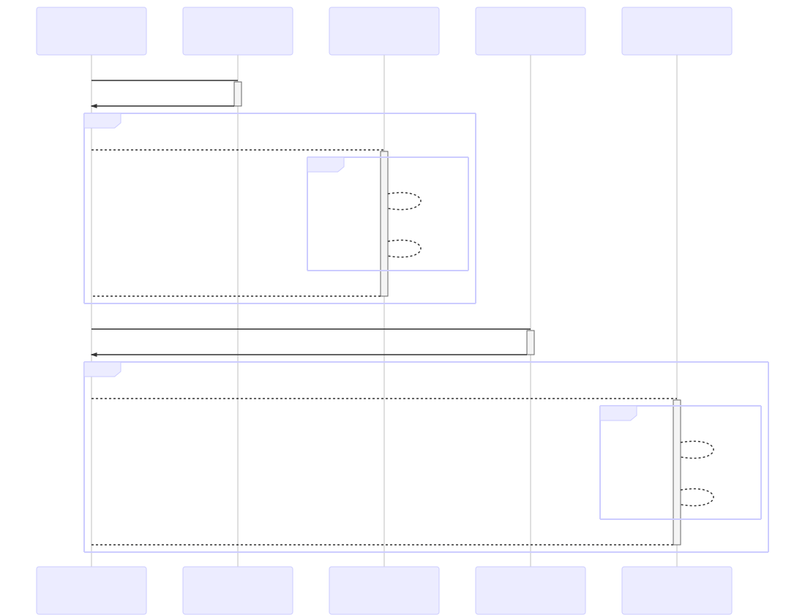
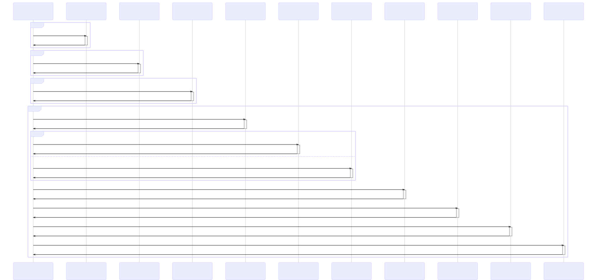
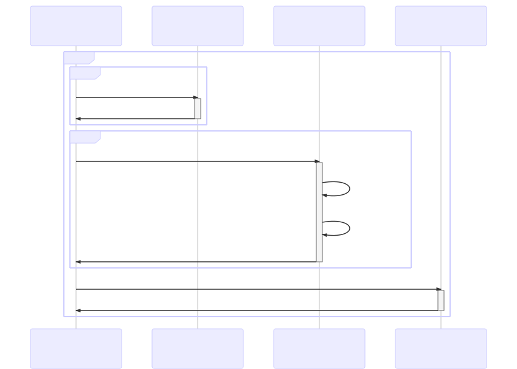

# hornet-js-builder

`hornet-js-builder` a été développé dans le but premier de masquer la complexité des différentes tâches nécessaires à la construction d'un projet. Son second objectif est d'accompagner le développeur en lui fournissant des outils tout au long du developpement d'un projet.

## 1. <a name='TableofContents'></a>Table of Contents

-   2. [Installation](#Installation)
    -   2.1. [Depuis NPM](#DepuisNPM)
    -   2.2. [Depuis les sources](#Depuislessources)
    -   2.3. [En tant que devDependencies de l'application](#EntantquedevDependenciesdelapplication)
    -   2.4. [Note](#Note)
    -   2.5. [Commandes](#Commandes)
-   3. [Variables d'environnement utilisées par le builder](#Variablesdenvironnementutilisesparlebuilder)
-   4. [Principe de gestion des dépendances](#Principedegestiondesdpendances)
-   5. [Utiliser hornetbuilder en ligne de commandes](#Utiliserhornetbuilderenlignedecommandes)
-   6. [Utiliser hornetbuilder en mode interactive](#Utiliserhornetbuilderenmodeinteractive)
-   7. [Configurer un projet pour utiliser hornetbuilder](#Configurerunprojetpourutiliserhornetbuilder)
    -   7.1. [Fichier de configuration des dépendances : `package.json`](#Fichierdeconfigurationdesdpendances:package.json)
        -   7.1.1. [Exemple complet de `package.json`](#Exemplecompletdepackage.json)
    -   7.2. [Fichier de configuration Typescript pour la compilation : `tsconfig.json`](#FichierdeconfigurationTypescriptpourlacompilation:tsconfig.json)
    -   7.3. [Fichier de configuration builder : `.builder.js`](#Fichierdeconfigurationbuilder:builder.js)
    -   7.4. [Ajout d'une tâche custom](#Ajoutdunetchecustom)
    -   7.5. [Objet de configuration du builder](#Objetdeconfigurationdubuilder)
        -   7.5.1. [Configuration projet](#Configurationprojet)
-   8. [Les tâches fournies par hornetbuilder](#Lestchesfourniesparhornetbuilder)
    -   8.1. [Les tâches de gestion des dépendances](#Lestchesdegestiondesdpendances)
    -   8.2. [Les tâches de compilation](#Lestchesdecompilation)
    -   8.3. [Les tâches de test](#Lestchesdetest)
    -   8.4. [Les tâches de nettoyage](#Lestchesdenettoyage)
    -   8.5. [Les tâches de construction des livrables](#Lestchesdeconstructiondeslivrables)
    -   8.6. [Les tâches de watch](#Lestchesdewatch)
    -   8.7. [Les tâches de qualimétrie](#Lestchesdequalimtrie)
    -   8.8. [Tâches SASS](#TchesSASS)
    -   8.9. [Approche Composant](#ApprocheComposant)
    -   8.10. [divers](#divers)
        -   8.10.1. [entête des fichers](#enttedesfichers)
-   9. [Le cycle de vie d'un projet](#Lecycledeviedunprojet)
    -   9.1. [Première utilisation du builder](#Premireutilisationdubuilder)
    -   9.2. [En cours de développement](#Encoursdedveloppement)
    -   9.3. [Lancement des tests](#Lancementdestests)
        -   9.3.1. [MochaJs](#MochaJs)
        -   9.3.2. [KarmaJs](#KarmaJs)
        -   9.3.3. [Templating Html](#TemplatingHtml)
    -   9.4. [Construction des livrables](#Constructiondeslivrables)
    -   9.5. [Publication](#Publication)
    -   9.6. [Changement de version](#Changementdeversion)
    -   9.7. [Changement de version d'une dépendance](#Changementdeversiondunedpendance)
    -   9.8. [Changement de version d'une dépendance en snapshot](#Changementdeversiondunedpendanceensnapshot)
    -   9.9. [Recherche de dernière version d'une dépendance](#Recherchededernireversiondunedpendance)
    -   9.10. [Recherche de dernière version d'une dépendance](#Recherchededernireversiondunedpendance-1)
-   10. [Erreurs connues](#Erreursconnues)
    -   10.1. [ENOSPC: System limit for number of file watchers reached](#ENOSPC:Systemlimitfornumberoffilewatchersreached)
-   11. [Licence](#Licence)

## 2. <a name='Installation'></a>Installation

### 2.1. <a name='DepuisNPM'></a>Depuis NPM

```shell

npm install -g hornet-js-builder

```

s'assurer que les liens symboliques `hornetbuilder` et `hb` ont bien été crées dans le répertoire "~/bin". Si ce n'est pas le cas:

se positionner dans le répertoire "~/bin", puis:

```shell

ln -s ${cheminAccesHornetBuilderInstalléDansNode}/bin/builder-cli.js hb
ln -s ${cheminAccesHornetBuilderInstalléDansNode}/bin/builder-cli.js hornetbuilder

```

### 2.2. <a name='Depuislessources'></a>Depuis les sources

Installer `hornet-js-builder` de manière globale:

-   Se placer dans le dossier de _hornet-js-builder_
-   Lancer la commande

```shell
npm install -g
```

### 2.3. <a name='EntantquedevDependenciesdelapplication'></a>En tant que devDependencies de l'application

Depuis La version 2.0.0, il est possible d'ajouter le builder en tant que dépendance d'une application. Ainsi, dans la partie script du package.json de l'application, il est possible de faire référence aux commandes du builder depuis les node_modules.

Exemple:

```js
{
    //...
    "devDependencies" : {
        //...
        "hornet-js-builder": "2.x.x"
        //...
    },

    "script": {
        //...
        "clean": "./node_modules/.bin/hornetbuilder clean-all",
        "test": "./node_modules/.bin/hornetbuilder test",
        "init-dev": "./node_modules/.bin/hornetbuilder compile:ts",
        "start": "node index.js",
        "prestart": "npm run init-dev && ./node_modules/.bin/hornetbuilder ppc",
        "start-dev": "./node_modules/.bin/hornetbuilder w"
        //...
    }
    //...
}
```

### 2.4. <a name='Note'></a>Note

En cas de MAJ à partir d'une version antérieure de `hornet-js-builder`: supprimer les dossiers `node_modules` de chaque projet

### 2.5. <a name='Commandes'></a>Commandes

Suite à cette installation, les commandes `hornetbuilder` et `hb` (alias de la première) sont accessibles en globale dans les scripts, sauf dans le cas où le builder est installée en tant que dépendance de l'application

## 3. <a name='Variablesdenvironnementutilisesparlebuilder'></a>Variables d'environnement utilisées par le builder

-   `HB_EXT_MODULES` : Cette variable contient les chemins, séparés par un point virgule, des répertoires des externalModules utilisés par l'application. L'utilisation de cette variable est préconisée plutôt en cas d'utilisation de modules externes.

-   `HB_WATCH_DELAY` : Permet de surcharger la clé de configuration _delay_ de nodemon.

## 4. <a name='Principedegestiondesdpendances'></a>Principe de gestion des dépendances

Un projet géré par le builder est un projet node classique avec une déclaration des dépendances dans le fichier package.json.

-   `dependencies`: Pour déclarer les dépendances applicatives
-   `devDependencies`: Pour déclarer les dépendances de build (les dépendances nécessaires uniquement pour les TU, la documentation des modules utilisés, les modules nécessaires lors du package etc.)
-   `peerdependencies`: Pour déclarer les dépendences du host qui sont nécessaires à l'installation du module
-   `bundleddependencies`: Pour déclarer un tableau de dépendances qui seront packagés lors de la publication du module
-   `optionaldependencies`: Pour déclarer les dépendances optionnelles c'est-à-dire celles dont une erreur d'install ne causera pas de build failure.

## 5. <a name='Utiliserhornetbuilderenlignedecommandes'></a>Utiliser hornetbuilder en ligne de commandes

-   Ouvrir une invite de commande et se placer dans le dossier du projet.

Exemple:

```shell
cd D:\dev\workspace\applitutoriel\applitutoriel-js
```

-   Taper la commande `hornetbuilder` (ou `hb`) suivi de la tâche à exécuter. Exemple:

```shell
hb test
```

Une aide est fournie en tapant la commande

```shell
hb --help
```

Les options suivantes sont alors proposées:

| Option | Rôle |
| --- | --- |
| `-V`, `--version` | Affiche la version du builder |
| `-d`, `--debug` | Active les messages de logs du builder en mode debug |
| `--show-webpack-files` | Active le listing des fichiers embarqués par webpack lors de la construction du bundle de fichiers clients. Note: Les fichiers sont triés par taille croissante |
| `--webpackVisualizer` | Visualisation de la répartition des sources projets et node modules dans un chart, /static/dev/webpack-visualizer.html |
| `-i`, `--ide` | Indique que c'est l'IDE qui gère la compilation des fichiers .ts, .d.ts et .map. Dans ce mode la compilation des fichiers TypeScripts est désactivée ainsi que les watchers associés. De même, la tâche clean ne supprime plus ces fichiers. <br /> Cette option doit être utilisée dès lors qu'un IDE est lancé sur les projets |
| `-r`, `--registry <URL>` | Permet d'utiliser un repository spécifique. Par défaut le repository défini dans le fichier `.npmrc` est utilisé |
| `--publish-registry <URL>` | Permet de spécifier un repository npm spécifique pour la publication autre que celui par défaut. Par défaut le repository défini dans le fichier `.npmrc` est utilisé |
| `-f`, `--force` | Permet de forcer la mise à jour des dépendances |
| `--skipTests` | Permet de ne pas exécuter les tests si ceux-ci doivent être exécutés (ex: tâche `package`) |
| `--skipDedupe` | Permet de ne pas exécuter npm dedupe sur l'installation des dépendances |
| `--stopOnError` | Permet de stopper toutes les tâches sur une erreur dans les tests |
| `--skipMinified` | Permet de ne pas minifier les chuncks |
| `--noWarn` | Permet de ne pas afficher les warning |
| `-p`, `--debugPort <port>` | Indique le port utilisé par node pour permettre la connexion d'un debugger externe |
| `--file` | Indique le chemin d'un fichier |
| `--tsfile` | Indique le nom du fichier de configutaion typescript à utiliser |
| `--dev` | active le mode developpement |
| `--offline` | active le mode offline pour la récupération des dépendances, ex : coupure réseau. Prerequis avoir les node_modules, ajouter fetch-retries=0 dans .npmrc |
| `--versionFix` | Indique la version ou suffixe si commence par '-', '.' ou si null calcule un suffixe avec timestamp, si 'RC' calucle la prochaine RC. |
| `--versionSearch` | préfixe de la dernière version |
| `--dependencyVersionFix <dependency>` | Dépendance dont on souhaite fixer une version |
| `-m`, `--module <module>` | Indique le module pour lequel on souhaite avoir une recherche de version |
| `-s`, `--silent` | Permet de n'afficher que les niveaux log error, warning ou log |
| `-e` | Active l'option **externalModules**, utilisé pour les projets multi-modules |

Toutes les autres options non prises en charge par le builder, sont passées directement aux outils tiers. Pour le moment seul NPM est concerné par ce principe (donc les taches d'installation), exemple :

```shell
hb install --no-package-lock
```

ne sauvegardera pas les dépendances installées de le fichier package-lock.json.

```shell
hb install -E
```

sauvegardera les dépendances installées en version exacte dans le package.json mais qu'avec la présence d'external module, car chaque module est installé avec la commande 'npm i <modulename>@<versoin>' sinon c'est la commande 'npm i' donc pas besoin de présicer le -E (save exact)

au même titre que :

```shell
hb compile -E
```

exécutera l'installation des dépendances de dev avec l'option 'exact' sur le même principe que vu précédemment (suivant la présence de module externe).

donc cf https://docs.npmjs.com/misc/config.html et https://docs.npmjs.com/cli/install.html

## 6. <a name='Utiliserhornetbuilderenmodeinteractive'></a>Utiliser hornetbuilder en mode interactive

Le principe du mode interactive est d'être immergé dans les commandes du builder sans pour autant à avoir à retaper "hb ..." et de bénéficier d'un mode intuitif d'autocompletion.

```shell
hb
```

Résultat :

```shell
[15:49:52]
  _    _                       _       _
 | |  | |                     | |     (_)
 | |__| | ___  _ __ _ __   ___| |_     _ ___
 |  __  |/ _ \| '__| '_ \ / _ \ __|   | / __|
 | |  | | (_) | |  | | | |  __/ |_  _ | \_ \
 |_|  |_|\___/|_|  |_| |_|\___|\__|(_)| |___/
                                     _/ |
                                    |__/

[15:49:52] Démarrage de hornet-js-builder dans  /home/<user>/Dev/workspaceJS/applitutoriel-modules/applitutoriel-js
[ '/home/<user>/Dev/node-vX.X.0-linux-x64/bin/node',
  '/home/<user>/bin/hbn' ]
[16:01:33] Builder lancé sur le projet applitutoriel-js en version 5.X.0
[16:01:33] Utilisation du registry configuré dans NPM : http://artifactory.app.diplomatie.gouv.fr/artifactory-dev/api/npm/repository-npm-mae-dev
[16:01:35] Chargement des tâches du projet 'applitutoriel-js'
[16:01:35] __la task rewrite est terminée
[16:01:35] _Starting 'dependencies:install-dev'...
[16:01:35] Lancement installation des dépendances de applitutoriel-js
[16:01:37] _Finished 'dependencies:install-dev' after 2.67 s
[16:01:37] _Starting 'default'...
[16:01:37] __Starting 'interactive'...
hb$
```

le prompt "hb$" s'affiche est permet alors de lancer n'importe quelle commande du builder.

Il est possible de lister toutes les commandes avec un double "tab" ou bien d'utiliser l'aide

```shell
hb$ help
```

L'arrêt du mode interactive ce fait avec la commande "exit".

```shell
hb$ exit
```

## 7. <a name='Configurerunprojetpourutiliserhornetbuilder'></a>Configurer un projet pour utiliser hornetbuilder

### 7.1. <a name='Fichierdeconfigurationdesdpendances:package.json'></a>Fichier de configuration des dépendances : `package.json`

#### 7.1.1. <a name='Exemplecompletdepackage.json'></a>Exemple complet de `package.json`

```json
{
    "name": "applitutoriel-js-lite",
    "version": "5.x.x",
    "license": "CECILL-2.1",
    "main": "index.js",
    "description": "Application tutoriel utilisant le Framework hornet",
    "bugs": {
        "url": "https://github.com/diplomatiegouvfr/applitutoriel-modules/issues"
    },
    "repository": {
        "type": "git",
        "url": "git+https://github.com/diplomatiegouvfr/applitutoriel-modules.git"
    },
    "dependencies": {
        "applitutoriel-js-common": "5.x.x",
        "hornet-js-core": "5.x.x",
        "hornet-js-database": "5.x.x",
        "hornet-js-passport": "5.x.x",
        "hornet-js-react-components": "5.x.x",
        "hornet-js-logger": "5.x.x",
        "hornet-js-utils": "5.x.x",
        "hornet-js-bean": "5.x.x",
        "pg": "~7.3.0",
        "sequelize": "~4.33.4",
        "sqlite3": "~3.1.13",
        "tslib": "~2.2.0"
    },
    "devDependencies": {
        "@types/node": "~10.12.30",
        "@types/react": "~16.8.14",
        "@types/sequelize": "~4.27.48",
        "hornet-js-test": "5.x.x"
    },
    "scripts": {
        "init-dev": "hb install",
        "start": "node index.js"
    },
    "author": "MEAE - Ministère de l'Europe et des Affaires étrangères"
}
```

### 7.2. <a name='FichierdeconfigurationTypescriptpourlacompilation:tsconfig.json'></a>Fichier de configuration Typescript pour la compilation : `tsconfig.json`

Les projets doivent impérativement avoir un fichier `tsconfig.json` à la racine. Celui-ci regroupe les informations de compilation typescript nécessaire au projet.

ex :

```json
{
    "compilerOptions": {
        "baseUrl": "./",
        "emitDecoratorMetadata": true,
        "esModuleInterop": false,
        "experimentalDecorators": true,
        "importHelpers": true,
        "jsx": "react",
        "lib": ["dom", "es2015"],
        "module": "commonjs",
        "moduleResolution": "node",
        "resolveJsonModule": true,
        "skipLibCheck": true,
        "sourceMap": true,
        "target": "ES5",
        "preserveSymlinks": true
    },
    "include": [
        "index.ts",
        "src/**/*.ts*",
        "test/**/*.ts*",
        "./node_modules/applitutoriel-js-common/index.d.ts",
        "./node_modules/hornet-js-bean/index.d.ts",
        "./node_modules/hornet-js-components/index.d.ts",
        "./node_modules/hornet-js-core/index.d.ts",
        "./node_modules/hornet-js-database/index.d.ts",
        "./node_modules/hornet-js-logger/index.d.ts",
        "./node_modules/hornet-js-utils/index.d.ts",
        "./node_modules/hornet-js-passport/index.d.ts",
        "./node_modules/hornet-js-react-components/index.d.ts",
        "./node_modules/hornet-js-test/index.d.ts"
    ],
    "exclude": ["istanbul"]
}
```

### 7.3. <a name='Fichierdeconfigurationbuilder:builder.js'></a>Fichier de configuration builder : `.builder.js`

Les projets doivent comporter à la racine un fichier `.builder.js` afin de déterminer le type de l'application : `application`, `module`, ... ainsi que les différentes tâches à éxécuter nécessaire à la construction.

Ce fichier doit comporter au minimum le code suivant pour hornet.js:

```javascript
module.exports = {
    type: "application",

    gulpTasks: function (gulp, project, conf, helper) {
        //Add task if needed
        /*gulp.beforeTask("compile", function () {
         helper.info("Exemple before compile task");
         });

         gulp.afterTask("compile", function () {
         helper.info("Exemple after compile task");
         });*/

        // Cas PARTICULIER de l'application tuto pour pouvoir la générer en mode SPA et ISOMORPHIC sur la PIC
        // => on force la tâche prepare-package:spa tout le temps
        // si mode fullSpa : on redéfini les tâches 'watch' & 'watch-prod' pour y inclure la tâche "prepare-package-spa"
        //gulp.task("watch", ["compile", "prepare-package:spa", "watch:client"]);
        //gulp.task("watch-prod", ["compile", "prepare-package:spa", "watch:client-prod"]);
        gulp.addTaskDependency("package-zip-static", "prepare-package:spa");
        // conf.template.messages = require("applitutoriel-js-common/src/resources/messages.json")
        conf.template.forEach((elt, idx) => {
            if (conf.template[idx].context.forEach) {
                conf.template[idx].context.forEach((elt, idx2) => {
                    conf.template[idx].context[idx2].messages = { applicationTitle: "Application TUTORIEL" };
                });
            } else {
                conf.template[idx].context.messages = { applicationTitle: "Application TUTORIEL" };
            }
        });
    },
    externalModules: {
        enabled: false,
        directories: [],
    },
    config: {
        routesDirs: ["." + path.sep + "routes"],

        // Exemple d'exclusion de fichiers/répertoires local à l'application et de modules
        // Cet exemple n'est pas forcement cohérent puisque le client.js n'est pas dépendant des middlewares
        // Il est là à titre d'exemple uniquement

        clientExclude: {
            dirs: [
                path.join("src", "services", "data"),
                "src/middleware",
                "nodemailer",
                "applitutoriel-js-common/src/actions",
            ],
            filters: [path.join("src", "services", "data") + "/.*-data-.*", ".*/src/actions/.*", "^config/*"],
            modules: [
                "config",
                "continuation-local-storage",
                "carbone",
                "pdfmake",
                "pdfmake/src/printer",
                "pdfkit",
                "nodemailer",
                "fontkit",
            ],
        },
        clientContext: [
            [/moment[\/\\]locale$/, /fr|en/],
            [/intl[\/\\]locale-data[\/\\]jsonp$/, /fr|en/],
            [/.appender/, /console/],
        ],
        typescript: {
            //bin: "~/Dev/node-v4.5.0-linux-x64/lib/node_modules/typescript"
        },
        template: [
            {
                context: [
                    {
                        error: "404",
                        suffixe: "_404",
                        message: "Oops! Nous ne trouvons pas ce que vous cherchez!",
                    },
                    { error: "500", suffixe: "_500", message: "Oops! Une erreur est survenue!" },
                ],
                dir: "./template/error",
                dest: "/error",
            },
            {
                context: { message: "test template" },
            },
        ],
        spaResources: [path.join("..", "applitutoriel-js-common", "src", "resources") + "**/*.json"],
        dev: {
            dllEntry: {
                vendor: ["ajv", "react-dom", "react", "bluebird", "moment", "intl", "moment-timezone", "lodash"],
            },
        },
    },
};
```

Ce fichier doit comporter au minimum le code suivant pour hornet.js-lite:

```javascript
module.exports = {
    type: "application",

    gulpTasks: function (gulp, project, conf, helper) {

        helper.excludeNodeModulesFromWebpack(
            ["config", "continuation-local-storage", "sequelize", "pdfmake", "carbone", "csv-parser", "nodemailer"],
            conf.webPackConfiguration
        );
        conf.template.forEach((elt, idx) => {
            if (conf.template[idx].context.forEach) {
                conf.template[idx].context.forEach((elt, idx2) => {
                conf.template[idx].context[idx2].messages =  {"applicationTitle": "Application TUTORIEL"};
                });
            } else {
                conf.template[idx].context.messages =  {"applicationTitle": "Application TUTORIEL"};
            }
        });
    },

    externalModules: {
        enabled: false,
        directories: [
        ]
    },

    config: {
        routesDirs: ["." + path.sep + "routes"],
        ressources: ["database/**/*"],
        // Exemple d'exclusion de fichiers/répertoires local à
  "compilerOptions": {
    "baseUrl": "./",
    "emitDecoratorMetadata": true,
    "esModuleInterop": false,
    "experimentalDecorators": true,
    "importHelpers": true,
    "jsx": "react",
    "lib": ["dom", "es2015"],
    "module": "commonjs",
    "moduleResolution": "node",
    "resolveJsonModule": true,
    "skipLibCheck": true,
    "sourceMap": true,
    "target": "ES5",
    "preserveSymlinks": true
  },
            dirs: [
                path.join("src", "services", "data"),
                path.join("src", "dao"),
                "src/middleware",
                "nodemailer"],
            filters: [
                path.join("src", "services", "data") + "/.*-data-\.*"
            ],
            modules: [
                "hornet-js-database",
                "config",
                "continuation-local-storage",
                "sequelize",
                "pdfmake",
                "carbone",
                "csv-parser",
                "nodemailer",
                "tls"
            ]
        },
        clientContext: [
            [/moment[\/\\]locale$/, /fr|en/],
            [/intl[\/\\]locale-data[\/\\]jsonp$/, /fr|en/],
            [/.appender/, /console/]
        ],
        typescript: { //bin: "~/Dev/node-v4.5.0-linux-x64/lib/node_modules/typescript"
        },
        karma: {
            template: {
                debug: "./test/template/debug.html",
                context: "./test/template/context.html",
                clientContext: "./test/template/client_with_context.html"
            }
        },
        template: [
            {
                context: [{error: "404", suffixe: "_404", message: "Oops! Nous ne trouvons pas ce que vous cherchez!"}, {error: "500", suffixe: "_500", message: "Oops! Une erreur est survenue!"}],
                dir: "./template/error",
                dest: "/error"
            }, {
                context: {message: "test template"}
            }
        ]
        dev: {
            dllEntry: {vendor: ["hornet-js-react-components", "hornet-js-components", "hornet-js-utils"]}//"ajv", "d3", "react-dom", "react", "bluebird", "moment", "intl", "moment-timezone", "lodash"
        }
    }
};
```

-   La clé `type` indique au builder le type de projet actuel. Pour une application le type doit toujours être `application` (types possibles : "parent", "application", "application-server", "module", "composant", "custom").

    -   `parent`: Comme son nom l'indique, c'est le type des projets parent.
    -   application: C'est le type d'une application. Par exemple, une application lite (générée à travers `generator-hornet-js-lite`), ou full (générée à travers `generator-hornet-js`).
    -   `application-server`: C'est le type d'une application exposant que des API, C'est par exemple le type des applications générée à travers `generator-hornet-js-batch`
    -   `module` ou `component`: Ces deux types sont utilisés par le framework. Ce sont les types des modules hornet ou hornet-comminity. Les projets peuvent l'utiliser s'ils veulent mettre dans des artefacts des composants/modules utilisables par leurs applications.
    -   `custom`: Le type custom est utilisé pour décrire les autres types ne cadrant pas avec les types ci-dessus.

-   La fonction `gulpTasks` permet :
    -   d'ajouter de nouvelles tâches gulp au moyen du paramètre `gulp`
    -   de modifier la configuration par défaut du builder (ajouter un répertoire de sources, modifier la conf webpack, ...)
    -   d'exécuter des traitements avant ou après une tâche spécifique au moyen des méthodes `gulp.beforeTask(taskName, func)` et `gulp.afterTask(taskName, func)`
    -   d'ajouter des dépendances à une tâche existante au moyen de la méthode `gulp.addTaskDependency(taskName, dependencyTaskName)`
-   L'objet `externalModules` permet de déclarer des dépendances à partir de répertoires externes.
-   L'objet `config` permet de surcharger la configuration du builder dans chaque application
    -   `autoGenerateIndex` permet d'autogénérer les `index.js`, `index.ts` (utile pour le mode dev et dll, ou l'import auto des dts). `index.d.ts` est autogénéré pour les types modules.
    -   `routesDirs` permet de spécifier les répertoires des routes pour le code splitting automatique
    -   `clientExclude` est un raccourci pour modifier la conf webpack et rajouter des **externals**
    -   `clientNoParse` est un raccourci pour modifier la conf webpack et rajouter des **module.noParse**
    -   `typescript.bin` permet de préciser une autre version de typescript pour la transpilation que celle utiliser ambarquée par le builder
    -   `spaResources` liste de filtres permettant d'ajouter des ressources pour la génération de chunck SPA
    -   `dllEntry` permet de préciser des dll webpack (gain de temps de construction des chunck)
    -   `template` permet de configurer la tâche de templating html
        -   `dir` répertoire des templates (par défault 'template')
        -   `context` objet disponible pour le templating
        -   `dest` répertoire de destination
    -   `clientContext` Filtre les modules ex moment et intl : [/moment[\/\\]locale$/, /fr|en/], [intl[\/\\]locale-data[\/\\]jsonp$/, /fr|en/]
    -   `spaFilter` Filtre les ressources pour le packaging spa, copie des fichiers ressource dans /static
    -   `dev` Expérimentation du builder
        -   `dllEntry` optimisation de chargement des librairies en dev
-   `context` contiendra par défaut :

```javascript

     {
       project:
       {
         name: project.name,
         version: project.version,
         static: "static-" + project.version + "/"
       }
     }
```

-   `prepare`
    -   `compile`
        -   othersFilesToCopy tableau contenant les ressources complémentaires à copier après la transpilation (utile pour les tests par exemple afin de ne pas modifier les import relatifss)
        -   `sourceMapsOption` option pour surcharger celles de génération des fichiers source map
    -   `publish`
        -   `outDir` chemin absolu du répertoire temporaire de préparation pour la publication
        -   `filesToCopy` tableau contenant les ressources à publier
        -   `othersFilesToCopy` tableau contenant les ressources complémentaires à publier

### 7.4. <a name='Ajoutdunetchecustom'></a>Ajout d'une tâche custom

Exemple:

```javascript
...
    gulpTasks: function (gulp, project, conf, helper) {
        gulp.task("maNouvelleTache", function(done) {
            helper.info("Execution de 'maNouvelleTache'");
            done();
       });
    },
...
```

```shell
hb maNouvelleTache
```

### 7.5. <a name='Objetdeconfigurationdubuilder'></a>Objet de configuration du builder

La configuration par défaut du builder est la suivante:

```javascript
{
    src: "src",
    test: "test",
    static: staticDir,
    header: {},
    database: "database",
    environment: {
        dir: "environment",
        configuration: "environment/configuration",
        templates: "environment/templates"
    },
    testEnvironment: {
        dir: "test-environment",
        configuration: "test-environment/configuration",
        templates: "test-environment/templates"
    },
    js: "js",
    dll: "dll",
    config: "./config",
    generatedTypings: {
        dir: ".",
        file: "definition.d.ts"
    },
    clientJs: "client.js",
    routesDirs: ["." + path.sep + "routes"],
    componentsDirs: [path.join("..", "src")],
    buildWorkDir: "target",
    testReportDir: testReportDir,
    testWorkDir: testWorkDir,
    templateDir: "html",
    mocha: {
        preserveSymlinks: true
    },
    istanbul: {
        coverageVariable: "__coverage__",
        dir: path.join(testReportDir),
        reporters: ["lcov", "text", "text-summary", "cobertura", "json", "html"],
        reportOpts: {
            dir: path.join(testReportDir, "mocha"),
            lcov: { dir: path.join(testReportDir, "mocha", "lcov"), file: "lcov.info" },
            html: { dir: path.join(testReportDir, "mocha", "html") },
            json: { dir: path.join(testReportDir, "mocha"), file: "coverage_mocha.json" },
            cobertura: { dir: path.join(testReportDir, "mocha") }
        },
        instrumenter: {
            includeUntested: true,
            preserveComments: true,
            noCompact: true,
            all: true,
            "include": [
                "src/**/*.js"
            ],
            "exclude": [
                "node_modules/**/*"
            ],
            inPlace: true,
            sourceMap: true
        }
    },
    karma: {
        reporters: ["mocha", "coverage"],
        reportOpts: {
            dir: path.join(testReportDir, "karma"),
            lcov: { dir: path.join(testReportDir, "karma", "lcov"), file: "lcov.info" },
            html: { dir: path.join(testReportDir, "karma", "html") },
            json: { dir: path.join(testReportDir, "karma"), file: "converage_karma.json" }
        }
    }, merge: {
        reporters: ["lcov", "text", "text-summary", "cobertura", "json", "html"],
        reportOpts: {
            dir: path.join(testReportDir, "merge"),
            lcov: { dir: path.join(testReportDir, "merge", "lcov"), file: "lcov.info" },
            html: { dir: path.join(testReportDir, "merge", "html") },
            json: { dir: path.join(testReportDir, "merge"), file: "coverage.json" },
            cobertura: { dir: path.join(testReportDir, "merge") }
        }
    }, remap: {
        reporters: ["lcovonly", "text", "text-summary", "cobertura", "json", "html"],
        reportOpts: {
            dir: path.join(testReportDir, "remap"),
            lcovonly: { dir: path.join(testReportDir, "remap", "lcov"), file: "lcov.info" },
            html: { dir: path.join(testReportDir, "remap", "html") },
            json: { dir: path.join(testReportDir, "remap"), file: "coverage.json" },
            cobertura: { dir: path.join(testReportDir, "remap"), file: "cobertura-coverage.xml" }
        }

    },
    webPackConfiguration: {
        module: {}
    },
    webPackMinChunks: 3,
    template: {
        context: {}
    },
    prepare: {
        compile: {
            othersFilesToCopy: [
                "./package.json",
                "./package-lock.json",
                path.join(".", conf.src, "**", "*"),
                path.join(".", conf.test, "**", "*"),
                path.join("!" + conf.src, "**/*.ts"),
                path.join("!" + conf.src, "**/*.tsx"),
                path.join("!" + conf.test, "**/*.ts"),
                path.join("!" + conf.test, "**/*.tsx")
            ]
        },
        publish: {
            filesToCopy: [
                "*.js",
                "*.d.ts",
                path.join(".", conf.src, "**", "*"),
                path.join("!" + conf.src, "**/*.ts"),
                path.join("!" + conf.src, "**/*.tsx"),
                `!${conf.test}`,
                `!${conf.test}/**/*`,
                `!${conf.prepare.publish.outDir}`,
                `!${conf.prepare.publish.outDir}/**/*`,
                "!builder.js",
                "package.json"],
            othersFilesToCopy: [
                "*",
                "**/*",
                `!${conf.prepare.publish.outDir}`,
                `!${conf.prepare.publish.outDir}/**/*`,
                "!.*/*",
                "!.*/**/*",
                "!definition-ts",
                "!definition-ts/**/*",
                "!node_modules/**/*",
                "!node_modules",
                "!tmp/**/*",
                "!tmp",
                "!" + conf.generatedTypings.dir,
                "!" + conf.generatedTypings.dir + "/**/*",
                "!**/*.tsx",
                "!**/*.ts",
                "!*.js",
                "!*.js.map",
                "!" + conf.test,
                "!" + conf.test + "/**/*",
                "!" + conf.testReportDir,
                "!" + conf.testReportDir + "/**/*",
                "!" + conf.testWorkDir,
                "!" + conf.testWorkDir + "/**/*",
                "!" + conf.environment.dir,
                "!" + conf.environment.dir + "/**/*",
                "!" + conf.buildWorkDir,
                "!" + conf.buildWorkDir + "/**/*",
                "!" + (conf.template.dir || project.dir + "/template"),
                "!" + (conf.template.dir || project.dir + "/template") + "/**/*",
                "!*.env",
                "!*.cert",
                "!*.pem",
                "!builder.js",
                "!tsconfig.json",
                "!tests.webpack.js",
                "!*.properties",
                "!package-lock.json",
                "!.jfrog",
                "!.npm-cache",
                "!.nyc_out.json",
                ".npmignore",
                ".gitignore",
                ".svnignore"],
            outDir: path.join(project.dir, conf.prepare.publish.outDir)
        }
}

```

#### 7.5.1. <a name='Configurationprojet'></a>Configuration projet

##### Configuration webpack

Le builder propose une configuration webpack par défaut pour les applications. Cependant, les projets sont libres de la surchager ou même de fournir leur configuration. Celle-ci doit être dans un fichier à la racine du projet :

-   `webpack.config.js` : Ce fichier doit contenir toute la configuration webpack dont a besoin le projet. Il doit exporter une fonction et retourner la configuration à utiliser. Si ce fichier est présent, aucune configuration du builder ne sera usitée. Il est possible de le décliner par environnement par exemple `webpack.config.prod.js`, `webpack.config.dev.js` etc, avec la valeur de la variable d'environnement _NODE_ENV_.

```js
/**
 * @param {object} project information du projet concerné.
 * @param {object} conf configuration du projet.
 * @param {object} helper classe Helper du builder.
 * @param {object} webpackConfigPart méthodes de constitution de la configuration webpack (hornet-js-builder/src/builders/configuration/webpack/config-parts.js).
 * @param {object} configuration configuration webpack calculée pour le projet.
 * @param {object} webpack instance de webpack.
 */
module.exports = (project, conf, helper, webpackConfigPart, webpack) => {
    return {
        // Retourner la config complète de l'application
    };
};
```

-   `webpack.addons.config.js`: Pour fournir une partie de la configuration ou surchager celle du builder, utiliser plutôt le fichier `webpack.addons.config.js`. Ce dernier doit exporter une fonction et retourner la configuration à utiliser. Il est également possible de le décliner par environnement par exemple `webpack.addons.config.prod.js`, `webpack.addons.config.dev.js` etc, avec la valeur de la variable d'environnement _NODE_ENV_.

```js
module.exports = (project, conf, helper, webpackConfigPart, configuration, webpack) => {
    return {
        ...configuration,
        node: {
            global: true,
            process: true,
            __filename: true,
            __dirname: true,
            Buffer: true,
            setImmediate: true,
            cluster: "empty",
            child_process: "empty",
        },
    };
};
```

NB: Le builder ne fait pas de merge entre la configuration fournie et celle qu'elle propose. Il passe en argument de la fonction sa configuration. Le projet a la responsabilité de renvoyer dans l'objet retourné toute sa configuration.

##### Configuration karma

Le builder propose une configuration karma par défaut pour les applications. Cependant, les projets sont libres de la surchager ou même de fournir la configuration complète. Les projets qui souhaitent fournir une configuration karma spécifique doivent la décrire dans un des fichiers suivants à la racine :

-   `karma.config.js` : Ce fichier doit contenir toute la configuration karma dont a besoin le projet. Il doit exporter une fonction et retourner la configuration à utiliser. Si ce fichier est présent, aucune configuration du builder ne sera usitée. Il est possible de le décliner par environnement par exemple `karma.config.prod.js`, `karma.config.dev.js` etc, avec la valeur de la variable d'environnement _NODE_ENV_.

Exemple:

```js
module.exports = (project, conf, helper, webpackConfigPart) => {
    return {
        // Retourner la config karma complète de l'application
    };
};
```

-   `karma.addons.config.js`: Ce fichier est utilisé pour fournir une configuration spécifique ou surchager celle proposée par le builder. Il doit exporter une fonction et retourner la configuration à utiliser. Il est également possible de le décliner par environnement par exemple `karma.addons.config.prod.js`, `karma.addons.config.dev.js`.etc, avec la valeur de la variable d'environnement _NODE_ENV_.

```js
const path = require("path");

module.exports = (karmaConfig) => {
    return {
        ...karmaConfig,
        browsers: ["FirefoxHeadless"],
        customLaunchers: {
            FirefoxHeadless: {
                base: "Firefox",
                flags: ["-headless"],
            },
        },
        template: {
            debug: "./test/template/debug.html",
            context: "./test/template/context.html",
            clientContext: "./test/template/client_with_context.html",
        },
        clientContext: [
            [/moment[\/\\]locale$/, /fr|en/],
            [/intl[\/\\]locale-data[\/\\]jsonp$/, /((fr)|(en))$/],
            [
                /^\.$/,
                (context) => {
                    if (!/\/log4js\/lib$/.test(context.context)) return;
                    context.regExp = /^\.\/appenders\/console.*$/;
                    context.request = ".";
                },
            ],
        ],
        clientExclude: {
            modules: ["cluster", "continuation-local-storage"],
        },
    };
};
```

NB: Le builder ne fait pas de merge entre la configuration fournie et celle qu'elle propose. Il passe en argument de la fonction sa configuration. Le projet a la responsabilité de renvoyer dans l'objet retourné toute sa configuration.

## 8. <a name='Lestchesfourniesparhornetbuilder'></a>Les tâches fournies par hornetbuilder

### 8.1. <a name='Lestchesdegestiondesdpendances'></a>Les tâches de gestion des dépendances

`hornetbuilder` fourni les tâches suivantes afin de gérer les dépendances d'un projet :

| Tâche | Rôle | Dépendances | Types de projet supportés |
| --- | --- | --- | --- |
| dependencies:clean-all | supprime toutes les dépendances et le package-lock.json |  | \* |
| dependencies:clean | supprime les dépendances (contenu du répertoire node_modules) |  | \* |
| dependencies:install | lance la commande `npm install --prod` |  | \* |
| dependencies:install-link | Copie dans les node_modules les dependencies en lien |  | \* |
| dependencies:install-dev | Lance la commande `npm install --dev` |  | \* |
| dependencies:install-dev-link | Copie dans les node_modules les devDependencies en lien` |  | \* |
| dependencies:install-ci-prod | Lance la commande `npm ci --prod` |  | \* |
| dependencies:install-ci-dev | Lance la commande `npm ci --dev` |  | \* |
| install | install les dépendances de l'application | dependencies:install, dependencies:install-link, dependencies:install-dev, dependencies:install-dev-link | \* |
| versions:set | permet de changer la version du projet |  | \* |
| versions:get | permet de récupérer les versions du projet |  | \* |
| dependency:set | permet de changer la version d'un module de dépendance du projet |  | \* |
| dependency:set-snapshot | permet de changer la version d'un module de dépendance du projet avec une version snapshot | versions:get | \* |
| dependencies:versions:update | permet de changer la version d'une ou un ensemble de dépendances du projet avec une dernière version. A utiliser avec les options `versionSearch` et `module`. |  | \* |
| i | Alias de "install" | install | \* |
| modules:list | Donne la listes des sous projets avec un ordre de traitement suivant l'interdépendance |  | parent |

NB: Le type de projet fait référence au type défini dans le ficher `.builder.js`. La valeur `*` indique que la tâche est disponible pour tous les types de projet.

Le diagramme de séquence suivant explique les enchaînements effectués par la tâche `install` 

### 8.2. <a name='Lestchesdecompilation'></a>Les tâches de compilation

`hornetbuilder` fourni les tâches suivantes afin de compiler les sources d'un projet :

| Tâche | Rôle | Dépendances | Types de projet supportés |
| --- | --- | --- | --- |
| compile:ts | Transpile les sources TS en Javascript.<br />S'exécute uniquement si l'option "-i" (--ide) n'est pas utilisée. | clean | \* |
| compile | Transpile les sources TS en Javascript | [install, compile:ts] | parent, application, application-server, custom |
| compile:run | Transpile les sources TS en Javascript | [ compile:ts ] | parent, application, application-server, custom |
| compile:run | Transpile les sources TS en Javascript | [compile:ts, clean:index-dts, compute-index:dts, rewrite:module] | module, composant |
| compile | Transpile les sources TS en Javascript | [install, compile:ts, clean:index-dts, compute-index:dts, rewrite:module] | module, composant |


### 8.3. <a name='Lestchesdetest'></a>Les tâches de test

`hornetbuilder` fourni les tâches suivantes afin d'exécuter les tests d'un projet :

| Tâche | Rôle | Dépendances | Types de projet supportés |
| --- | --- | --- | --- |
| prepare:testSources | Copie les sources originales et compilées dans le répertoire de travail des tests : istanbul | compile | parent, application, application-server, custom |
| prepare:testSources | Copie les sources originales et compilées dans le répertoire de travail des tests : istanbul | [compile:ts, clean:index-dts, compute-index:dts] | module, composant |
| test:instrument | Défini les instruments de couverture de code sur les sources | prepare:testSources | \* |
| test | Exécute les tests unitaires et la mesure de couverture de code | clean:test, install, compile:ts, test:karma:run, test:merge-reports, test:remap-reports | parent, application, application-server, custom |
| test | Exécute les tests unitaires et la mesure de couverture de code | clean:test, install, compile:ts, generate-index:dts, test:karma:run, test:merge-reports, test:remap-reports, rewrite:module | component, module |
| test:run | Exécute les tests mocha et karma | clean:test, test:karma:run, test:merge-reports, test:remap-reports | parent, application, application-server, custom |
| test:run | Exécute les tests mocha et karma | clean:test, generate-index:dts, test:karma:run, test:merge-reports, test:remap-reports, rewrite:module | module, composant |
| test:karma:run | Exécute les tests karma | [clean-test:karma] | \* |
| test:karma | Exécute les tests basées sur KarmaJs | install, compile:ts, test:karma:run | \* |


### 8.4. <a name='Lestchesdenettoyage'></a>Les tâches de nettoyage

`hornetbuilder` fournit les tâches suivantes afin de nettoyer un projet :

| Tâche | Rôle | Répertoire/fichier | Dépendances | Types de projet supportés |
| --- | --- | --- | --- | --- |
| clean | Supprime les fichiers générés (.js, .map et .d.ts dans le dossier de sources) |  | clean:src, clean:test | \* |
| clean:build | Supprime le répertoire de build | ./target |  | \* |
| clean:test | Supprime le dossier istanbul ainsi que les fichiers générés (.js, .map et .d.ts dans le dossier de tests) | test, test_report, karma_html |  | \* |
| clean:static | Supprime les fichiers statics générés par webpack | ./static/js |  | \* |
| clean:static-dll | Supprime les fichiers dll statics générés par webpack | ./static/js/dll |  | \* |
| clean:static-all | Supprime les fichiers dll statics générés par webpack + les dll | ./static/js/dll/\* | clean:static, clean:static-dll | \* |
| clean:src | Supprime les fichiers généré dans le répertoire source ./src | extended/_.js", "\*\*/_.json", "\*_/_.jsx |  | \* |
| clean:template | Supprime les templates générées dans la partie static | ./static/templateDir |  | \* |
| clean:publish | Supprime le tmpPublish généré suite à la pubbkication | ./tmpPublish |  | \* |
| clean:project | Supprime tous les fichiers et dépendances |  | clean, clean:build, dependencies:clean, clean:static, clean:template, clean:publish | \* |
| clean-all | Supprime tous les fichiers, dépendances et package-lock |  | clean, clean:build, dependencies:clean-all, clean:static, clean:template, clean:publish | \* |

### 8.5. <a name='Lestchesdeconstructiondeslivrables'></a>Les tâches de construction des livrables

`hornetbuilder` fourni les tâches suivantes afin de construire les livrables d'un projet :

| Tâche | Rôle | Dépendances | Types de projet supportés |
| --- | --- | --- | --- |
| prepare-package-dll | Lance WebPack pour la construction des dll's js client |  | application |
| prepare-package | Lance WebPack pour la construction du js client en mode production (pour les types application) et copie les livrables dans le répertoire target | prepare-package:minified(pour les types application), prepare-all-package | application, application-server |
| prepare-package:minified | Lance WebPack avec la minification pour la construction du js client, mode Production par défaut |  | application |
| prepare-package-client | Lance WebPack avec la minification pour la construction du js client, mode développement | prepare-package-dll | application |
| prepare-package:spa | Copie les ressources nécessaire pour le mode spa dans le répertoire static |  | application |
| prepare-package-spa | Prépare les fichiers à packager pour un projet en FullSpa mode Production | prepare-package:spa, prepare-package | application |
| prepare-all-package | copie les livrables dans le répertoire target | prepare-clean | application, application-server |
| template-html | Lance le templating html |  | application |
| zip-static | Construit le livrable statique (zip) |  | application |
| zip-dynamic | Construit le livrable dynamique (zip) |  | application, application-server |
| find-unused-template-var | Retrouve dans les fichiers \*.json des templates de test les variables inutilisées |  | application, application-server |
| generate-props2json | Transforme les \*.properties en json |  | application, application-server |
| generate-template | Génère les templates de configuration en valorisant correctement les variables | generate-props2json | application, application-server |
| validate-template | Vérifie que les variales dans les fichiers template sont correctement valorisées | generate-template | application, application-server |
| zip-environment | Construit le livrable environment (zip) | validate-template, find-unused-template-var | application, application-server |
| zip-database | Construit le livrable database (zip) |  | application, application-server |
| package-zip-static | Construit le livrable statique (zip) | prepare-package-client:minified, zip-static | application |
| package-zip-dynamic | Construit le livrable dynamique (zip) | prepare-package-client:minified, zip-dynamic | application application-server |
| package | Package global de l'application en mode Production | template-html, dependencies:install-ci-prod, prepare-package, zip-static, zip-dynamic,zip-environment, zip-database | application |
| package | Package global de l'application en mode Production | compile, test, dependencies:install-ci-prod, prepare-all-package, zip-dynamic, zip-environment, zip-database | application-server |
| package | Package global de l'application en mode Production | test | custom, parent, module, composant |
| package:spa | Package SPA de l'application en mode Production | compile, test, template-html, dependencies:install-ci-prod, prepare-package-spa, zip-static, zip-dynamic, zip-environment, zip-database | application |
| process-img | Déplacement des images vers le répertoires static |  | application |
| process:scss | Generation des css à partir des scss |  | application |
| process:sass | Lance node sass | process:img, process:scss | application |

Le diagramme suivant montre les enchainements effecués lors du lancement de la tâche package



### 8.6. <a name='Lestchesdewatch'></a>Les tâches de watch

`hornetbuilder` fourni les tâches suivantes afin d'outiller le démarrage d'une application en développement

| Tâche | Rôle | Dépendances | Types de projet supportés |
| --- | --- | --- | --- |
| watch:ts:exe | Ecoute les modifications sur les fichiers TS et les recompile à la volée.<br />S'exécute uniquement si l'option "-i" (--ide) n'est pas utilisée |  | application, application-server |
| watch:ts:run | Ecoute les modifications sur les fichiers TS et les recompile à la volée.<br />S'exécute uniquement si l'option "-i" (--ide) n'est pas utilisée | compile | application, application-server |
| watch:ts:exe | Ecoute les modifications sur les fichiers TS et les recompile à la volée.<br />S'exécute uniquement si l'option "-i" (--ide) n'est pas utilisée |  | custom, parent, composant, module |
| watch:ts:run | Ecoute les modifications sur les fichiers TS et les recompile à la volée.<br />S'exécute uniquement si l'option "-i" (--ide) n'est pas utilisée | dependencies:install, dependencies:install-link, generate-index, generate-index:dts, rewrite:module | custom, parent, composant, module |
| watch:serveur:exe | Ecoute les modifications sur les fichiers et redémarre le serveur node pour les prendre en compte.<br />Démarre nodejs en mode development |  | application, application-server |
| watch:serveur:run | Ecoute les modifications sur les fichiers et redémarre le serveur node pour les prendre en compte.<br />Démarre nodejs en mode development | watch:ts:run | application, application-server |
| watch:serveur-prod | Equivalent à watch:serveur mais avec nodejs en mode production | watch:ts:run | application, application-server |
| watch:exe | Ecoute les modifications des fichiers et redémarre le server | watch:ts:exe, watch:client:exe, watch:serveur:exe | application |
| watch:exe | Ecoute les modifications des fichiers et redémarre le server | watch:ts:exe, watch:serveur:exe | application-server |
| watch:exe | Ecoute les modifications des fichiers et redémarre le server | watch:ts:exe, watch:serveur:exe | parent, custom, composant, module |
| watch:run | Equivalent à watch:exe mais effectue en plus l'install et la compile des fichier | compile, watch:ts:exe, watch:client:exe, watch:serveur:exe | application |
| watch:run | Equivalent à watch:exe mais effectue en plus l'install et la compile des fichier | compile, watch:ts:exe, watch:serveur:exe | application-server |
| watch | Equivalent à watch:exe mais effectue en plus l'install et la compile des fichier | dependencies:install, compile, watch:ts:exe, watch:client:exe, watch:serveur:exe | application |
| watch | Equivalent à watch:exe mais effectue en plus l'install et la compile des fichier | dependencies:install, compile, watch:ts:exe, watch:serveur:exe | application-server |
| watch:client:exe | Ecoute les modifications sur les fichiers et relance WebPack à la volée.<br />Lance WebPack en mode development. | clean:static, prepare-package-dll | application |
| watch:client:run | Ecoute les modifications sur les fichiers et relance WebPack à la volée.<br />Lance WebPack en mode development. | clean:static, prepare-package-dll | application |
| watch:client | Ecoute les modifications sur les fichiers et relance WebPack à la volée.<br />Lance WebPack en mode development. | clean:static, prepare-package-dll, watch:ts:run | application |
| watch:client-prod | Similaire à watch:client:run mais avec WebPack en mode production sans lancer prepare-package-dll | clean:static, watch:ts | application |
| watch-prod | Compile et écoute les modifications pour redémarrer nodejs et relancer WebPack si besoin.<br />mode : production | dependencies:install, compile, watch:client-prod, watch:serveur-prod | application |
| watch-prod | Compile et écoute les modifications pour redémarrer nodejs et relancer WebPack si besoin.<br />mode : production | dependencies:install, compile, watch:serveur-prod | application-server |
| w | Alias de "watch" | watch | \* |
| wr | Alias de "watch:run" | watch:run | \* |
| we | Alias de "watch:exe" | watch:exe | \* |
| wp | Alias de "watch-prod" | watch-prod | application, application-server |

Le diagramme suivant explique les enchaînements de la tâche watch:exe



### 8.8. <a name='TchesSASS'></a>Tâches SASS

2 tâches sont prévues pour manipuler des fichiers SCSS:

```shell

hb process:sass

```

Cette tâche permet de générer un fichier CSS (par défaut, le fichier sera `./static/css/generated.css` comme indiqué dans la conf.)

```shell

hb watch:sass

```

Cette tâche permet de générer un fichier CSS puis de watcher les modifications des fichiers SCSS pour re-générer au besoin le fichier CSS.

Les tâches liées à SASS reposent sur la librairie `gulp-sass-image` laquelle génère par défaut un fichier `./static/css/_sass-image.scss`. Ce dernier contient des méthods utiles afin de manipuler les images (cf. [](https://github.com/npostulart/gulp-sass-image#supported-compass-functions) ). Ce fichier généré repose sur un template `mustache` qui'il est possible de surcharger.

### 8.9. <a name='ApprocheComposant'></a>Approche Composant

Il est également possible de générer des fichiers CSS à partir de fichiers SCSS en important ces derniers directement dans les composants React.

```javascript

import * as React from "react";
import { Utils } from "hornet-js-utils";

if(!Utils.isServer) {
    require("path/vers/Scss/File.scss");
}


export class MyComponent extends HornetComponent<MyComponentProps, MyComponentState> {

...

}


```

La déclaration d'un simple `require` dans un composant `.tsx` en le protégeant d'un `!Utils.isServer` permettra à `sass-loader` de générer le fichier CSS associé

### 8.10. <a name='divers'></a>divers

#### 8.10.1. <a name='enttedesfichers'></a>entête des fichers

| Tâche       | Rôle                                   | Dépendances |
| ----------- | -------------------------------------- | ----------- |
| file:header | ajoute une entête aux fichiers sources |             |

Permet d'ajouter une entête dans les fichiers sources. Par défault les fichiers traités sont :

-   ./.builder.js
-   ./index.ts
-   ./index.dts
-   répertoires src et test
    -   /\*_/_.ts
    -   /\*_/_.tsx
    -   /\*_/_.scss
    -   /\*_/_.js
    -   /\*_/_.jsx

Il est possible de gérer plus de répertoires et d'extensions grace à de la configuration dans le `.builder.js` avec `conf.header.otherDirs` et `conf.header.otherExts` qui attendent toutes les deux des tableaux de string.

L'entête ajouter est le contenu de _licenceFile_ et _headerFile_ avec comme variable de templating possible tout le contenu du fichier package.json

##### licenceFile

Le fichier "file-header-license.txt" si le projet en contient un sinon c'est la licence CECILL-2.1

##### headerFile

Le fichier "file-header.txt" si le projet en contient un sinon le template est :

```
/**
 * <%= pkg.name %>
 *
 * @author MEAE - Ministère de l'Europe et des Affaires étrangères
 * @version <%= pkg.version %>
 * @license CECILL-2.1
 */
```

## 9. <a name='Lecycledeviedunprojet'></a>Le cycle de vie d'un projet

### 9.1. <a name='Premireutilisationdubuilder'></a>Première utilisation du builder

Lors de la première utilisation du builder et peu importe la commande, le builder va installer les dépendances de construction/test afin que celles-ci soient disponibles dans le fichier `.builder.js`. Cela permet d'ajouter à un projet des tâches de construction dépendantes de modules non fournis par le framework. Il sera ainsi possible d'écrire dans le fichier `.builder.js` :

```javascript
var maDependanceSpecifique = require("maDependanceSpecifique");
```

### 9.2. <a name='Encoursdedveloppement'></a>En cours de développement

Dès la première utilisation du builder sur un projet, il est possible d'utiliser la commande :

```shell

hb watch

```

Dans un ide qui compile automatiquement les fichiers typescript, il est recommandé d'utiliser l'option -i

```shell

hb watch -i

```

ou bien :

```shell

hb w -i

```

Les dépendances entre les tâches du builder font que l'arbre des dépendances applicatives va être calculé, que les versions non fixées vont l'être, que l'ensemble des dépendances vont s'installer, que les sources vont se compiler, que le serveur nodejs va démarrer et que les modifications des fichiers seront écoutées.

Il est néanmoins possible de lancer indépendemment les différentes tâches :

```shell

hb dependencies:install

```

```shell

hb compile

```

```shell

hb watch

```

### 9.3. <a name='Lancementdestests'></a>Lancement des tests

#### 9.3.1. <a name='MochaJs'></a>MochaJs

```shell

hb test

```

Exécute les tests et fournit sur la console :

-   la description de chaque test exécuté
-   le nombre de tests OK et KO
-   si tous les tests sont OK : le taux de couverture de code total et fichier par fichier

Les fichiers exécutés doivent se trouver dans le répertoire **./test** et se nommer **\*-spec.js** sachant que la phase de compile passe avant.

#### 9.3.2. <a name='KarmaJs'></a>KarmaJs

```shell

hb test:karma

```

```shell

hb test:karma --file ./test/page/test.karma.js

```

Le test à exécuter est donné par le paramètre **-file** ou si aucun n'est précisé, il prend la configuration karma et par défaut c'est **tests.webpack.js**. Ce dernier référence tous les tests à exécuter grace à **require**, exemple qui tire tous les fichiers **\*.karma.js** dans le répertoire **test**:

```javascript
var context = require.context("./test", true, /\.karma\.js$/);
context.keys().forEach(context);
```

Les rapports sont générés dans le répertoire **./test_report**

Le navigateur utilisé par défaut est **Firefox**. Pour en ajouter ou en utiliser un autre, il faut surcharger la configuration dans le fichier **karma.addons.config.js** ou dans **karma.config.js** ou dand **karma.addons.config.[env].js** ou dans **karma.config.[env].js**, exemple :

```javascript

    config : {
        ....
        ..
        karma: {
            browsers: ["Chrome", "Firefox"],
        }
    }

```

Par défaut, lorsque les tests sont ouverts dans un navigateur, aucune feuille de style hornet n'est chargée. Il est possible de surcharger les templates karma:

```javascript

    config : {
        ....
        ..
        karma: {
            template: {
                debug: "./test/template/debug.html",
                context: "./test/template/context.html",
                clientContext: "./test/template/client_with_context.html"
            }
        }
    }

```

les templates fournis nécessitent de démarrer un serveur de thèmes.

#### 9.3.3. <a name='TemplatingHtml'></a>Templating Html

```shell
hb template-html
```

Lance le templating basé sur **EJS** et écrit les fichiers dans 'static/html' du projet.

Si l'objet de configuration _tempate_ est un tableau, il lancera autant de templating que d'élément dans le tableau, exemple :

```javascript
template: [
    {
        context: [
            { error: "404", suffixe: "_404", message: "Oops! Nous ne trouvons pas ce que vous cherchez!" },
            { error: "500", suffixe: "_500", message: "Oops! Une erreur est survenue!" },
        ],
        dir: "./template/error",
        dest: "/error",
    },
    {
        context: { message: "test template" },
    },
];
```

Dans cet exemple, le templating suivant est lancé :

1. Sur le répertoire "./template/error" et autant de fois que d'item dans l'attribut context (2). Les fichiers seront suffixés par l'attibut suffixe de chaque contexte (\_404, \_500) et générés dans le répertoire **error** (attibut _dest_) dans **static/html** du projet.
2. Sur le répertoire "./template" (valeur par défaut)

### 9.4. <a name='Constructiondeslivrables'></a>Construction des livrables

```shell

hb package

```

Construit les différents livrables et les place dans le répertoire `target` à la racine du projet.

### 9.5. <a name='Publication'></a>Publication

```shell

hb publish --publish-registry <URL>

```

Publie le module sur un repository spécifique.

### 9.6. <a name='Changementdeversion'></a>Changement de version

```shell

hb versions:set --versionFix=1.2.3

```

Modifie la version du projet ou des projets si on est sur un type parent en **'1.2.3'**.

```shell

hb versions:set --versionFix=

```

Modifie la version du projet en suffixant par un timestamp **'YYYYMMDDHHmmss'**.

```shell

hb versions:set --versionFix=RC

```

Modifie la version du projet en suffixant la prochaine version **'RC'** trouvé sur le repository de publication.

```shell

hb versions:set --versionFix=\'-123\'

```

Modifie la version du projet en suffixant par **'-123'**, il faut echapper les caractères **`**.

### 9.7. <a name='Changementdeversiondunedpendance'></a>Changement de version d'une dépendance

```shell

hb dependency:set --versionFix=1.2.3 --dependencyVersionFix=monpackage

```

Reprend les principes de `versions:set` mais sur les dépendances d'un projet.

### 9.8. <a name='Changementdeversiondunedpendanceensnapshot'></a>Changement de version d'une dépendance en snapshot

```shell

hb dependency:set-snapshot --dependencyVersionFix=monpackage --module=monpackage

```

### 9.9. <a name='Recherchededernireversiondunedpendance'></a>Recherche de dernière version d'une dépendance

```shell

hb versions:get --versionSearch=5.0.2 --module=hornet-js-core

```

Retourne la dernière version commencant par 5.0.2 du module hornet-js-core, exemple : 5.0.2-20180109183247. Si le module n'est pas renseigné, c'est sur le projet lui-même que la recherche est faite, et si `versionSearch` n'est pas renseigné c'est la dernière version qui est retournée (sans contrainte de préfixe)

```shell

hb versions:get --versionSearch=snapshot --module=hornet-js-core

```

Permet d'avoir la dernière version snapshot d'un module présent dans les dépendances du projet (dependencies, devDependencies, ...).

### 9.10. <a name='Recherchededernireversiondunedpendance-1'></a>Recherche de dernière version d'une dépendance

```shell
hb dependencies:versions:update --versionSearch=.* --module=hornet-js-.*

```

Permet de mettre la version des dépendances `hornet-js-.*` (expression régulière) a la dernière version `.*-rc\..*` (expression régulière contenant -rc.) en utlisant semver.

```shell
hb dependencies:versions:update --versionSearch=.*-rc\..* --module=hornet-js-.*

```

## 10. <a name='Erreursconnues'></a>Erreurs connues

### 10.1. <a name='ENOSPC:Systemlimitfornumberoffilewatchersreached'></a>ENOSPC: System limit for number of file watchers reached

Sous les systèmes linux, l'exécution de la commande watch du builder peut remonter un problème dans le cadre de projet contenant un nombre trop important de fichier.

```
ENOSPC: System limit for number of file watchers reached, watch '~/applitutoriel-modules/applitutoriel-js-lite/index.ts'
```

Résolution :

```
sudo sysctl -w fs.inotify.max_user_watches=100000
```

Si ce n'est pas suffisant, alors augmenter la limite file-max du user.

```
sudo sysctl -w fs.file-max=100000
```

## 11. <a name='Licence'></a>Licence

`hornet-js-builder` est sous [licence cecill 2.1](./LICENSE.md).

Site web : [](http://www.cecill.info/licences/Licence_CeCILL_V2.1-en.html)
